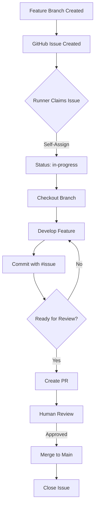

# Multi-Runner Coordination - SPECTRA-Grade Pattern

**Date:** 2025-12-06  
**Status:** 🟢 Canonical  
**Objective:** Coordinate multiple runners working on feature branches in parallel using SPECTRA autonomous agent patterns

---

## 🎯 SPECTRA-Grade Approach

**Core Principle:** *"Each runner is an autonomous agent with clear contracts and self-organizing capabilities."*

Following SPECTRA's multi-agent swarm orchestration pattern, we use:
1. **GitHub Issues as Contracts** - Clear assignment and acceptance criteria
2. **Self-Selection** - Runners claim work autonomously
3. **Isolated Branches** - No conflicts, parallel development
4. **Clear Completion Criteria** - Definition of Done per feature
5. **Evidence-Based Progress** - Commits, PRs, and test results

---

## 📋 The Pattern

### Step 1: Create Feature Issues (Contracts)

**Each feature branch gets a GitHub Issue that serves as:**
- **Contract** - What needs to be built
- **Assignment** - Which runner owns it
- **Progress Tracker** - Status updates and commits
- **Definition of Done** - Acceptance criteria

### Step 2: Self-Selection Process

**Runners claim work autonomously:**

1. **Review available issues** (labeled `status:available`)
2. **Claim by self-assigning** - Add yourself as assignee
3. **Update label** - Change to `status:in-progress`
4. **Checkout branch** - Start working
5. **Link commits** - Reference issue in commit messages (`#123`)

### Step 3: Progress Updates

**Runners update issues as they work:**

- **Commits** - Automatically linked via `#issue-number`
- **Status comments** - Update on blockers, decisions, progress
- **Test results** - Share Fabric test outcomes
- **PR links** - When ready for review

### Step 4: Completion & Merge

**When feature is complete:**

1. **Update issue** - Mark as `status:ready-for-review`
2. **Create PR** - Link PR to issue
3. **Self-review** - Runner reviews their own PR first
4. **Human review** - You review and merge
5. **Close issue** - Automatically via PR merge or manually

---

## 🔧 Implementation

### Creating Feature Issues

**Template for each feature:**

```markdown
## Feature: Activity Logging

**Branch:** `feature/activity-logging`  
**Priority:** High  
**Status:** `status:available`

### Acceptance Criteria

- [ ] `record()` method implements Delta table logging
- [ ] Writes to `Tables/log/sourcelog` with full session context
- [ ] Captures execution metadata, status, capabilities, errors, duration
- [ ] Tested in Fabric - table created and populated correctly
- [ ] Documentation updated

### Implementation Notes

- File: `spectraSDK.Notebook/notebook_content.py` - `NotebookSession.record()`
- Reference: `docs/ACTIVITY-LOGGING-SPECTRA-GRADE.md`
- Design doc: [link]

### Testing

- Run source stage notebook in Fabric
- Verify `Tables/log/sourcelog` table created
- Check logs contain full session context
```

---

## 🏗️ SPECTRA-Grade Workflow

### Autonomous Agent Pattern



---

## 📊 Issue Labels

### Status Labels

- `status:available` - Ready for a runner to claim
- `status:in-progress` - Currently being worked on
- `status:blocked` - Waiting on something
- `status:ready-for-review` - Complete, needs review
- `status:testing` - Being tested in Fabric
- `status:done` - Merged and closed

### Feature Labels

- `feature:activity-logging`
- `feature:sdk-based-tests`
- `feature:prepare-stage-init`
- `feature:discord-notifications`

### Priority Labels

- `priority:high`
- `priority:medium`
- `priority:low`

---

## 🤖 Runner Instructions

### How to Claim Work

1. **List available issues:**
   ```bash
   # Search for issues with status:available label
   ```

2. **Review the issue:**
   - Read acceptance criteria
   - Check branch name
   - Review implementation notes

3. **Claim the work:**
   - Assign yourself to the issue
   - Change label: `status:available` → `status:in-progress`
   - Comment: "Claiming this feature. Starting work on [branch]."

4. **Checkout and work:**
   ```bash
   git checkout feature/activity-logging
   # Make changes
   git commit -m "feat: implement activity logging (#123)"
   git push
   ```

5. **Update progress:**
   - Comment on issue with status updates
   - Link commits automatically via `#issue-number`
   - Share test results from Fabric

6. **When complete:**
   - Change label to `status:ready-for-review`
   - Create PR linking to issue
   - Comment with PR link and summary

---

## ✅ Coordination Benefits

1. **No Conflicts** - Each runner on separate branch
2. **Clear Ownership** - Self-assignment makes it obvious who's working on what
3. **Progress Visibility** - Issues show status of all features
4. **Autonomous** - Runners choose their work independently
5. **Evidence-Based** - Commits, PRs, and tests prove completion
6. **Review Process** - Clear path from development to merge

---

## 🔄 Example Workflow

### Runner 1 Claims Activity Logging

1. **See issue #1** - "Feature: Activity Logging" (status:available)
2. **Assigns self** - Changes label to `status:in-progress`
3. **Comments:** "Claiming this. Starting on `feature/activity-logging`."
4. **Works:** Implements, commits with `#1`, tests in Fabric
5. **Updates:** Comments with progress, test results
6. **Completes:** Creates PR, changes label to `status:ready-for-review`

### Runner 2 Claims SDK Tests

1. **See issue #2** - "Feature: SDK-Based Tests" (status:available)
2. **Assigns self** - Works independently on `feature/sdk-based-tests`
3. **No conflicts** - Different branch, different files
4. **Parallel progress** - Both runners work simultaneously

---

## 🎯 SPECTRA Principles Applied

1. **Autonomous Excellence** - Runners self-select and self-organize
2. **Clear Contracts** - Issues define what needs to be built
3. **Self-Documenting** - Status labels and comments show progress
4. **Modular** - Each feature is isolated in its own branch
5. **Evidence-Based** - Commits, PRs, and tests prove completion
6. **Review Process** - Human review before merge ensures quality

---

## 📋 Next Steps

1. **Create GitHub Issues** for each feature branch
2. **Label them** `status:available`
3. **Runners claim** by self-assigning
4. **Work in parallel** on isolated branches
5. **Review and merge** when complete

---

**Version:** 1.0.0  
**Date:** 2025-12-06  
**Status:** 🟢 Canonical SPECTRA Pattern

