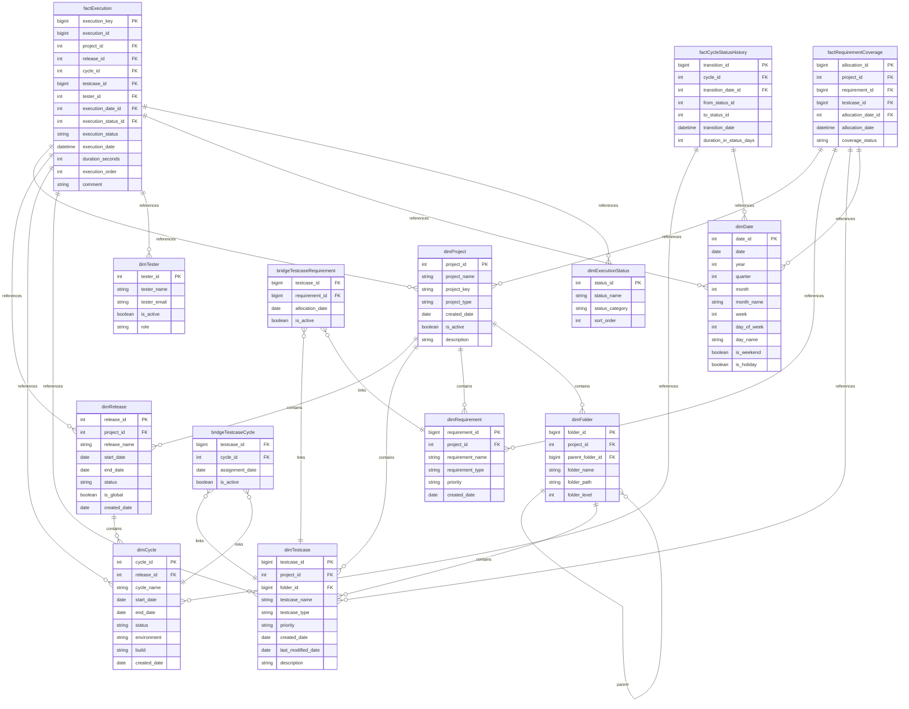

# Zephyr Dimensional Model - Visual Diagram

**Status:** 🟢 Complete  
**Version:** 1.0.0  
**Date:** 2025-12-06  
**Objective:** Power BI-style visual representation of Zephyr dimensional model with relationships

---

## 📊 Model View Diagram

This diagram represents the dimensional model in a Power BI-style format, showing all fact tables, dimensions, and relationships.



---

## 📐 Visual Layout (Power BI Style)

```
┌─────────────────────────────────────────────────────────────────┐
│                    ZEPHYR DIMENSIONAL MODEL                     │
└─────────────────────────────────────────────────────────────────┘

                    ┌──────────────────────┐
                    │    dimExecutionStatus│
                    └──────────┬───────────┘
                               │
                    ┌──────────▼───────────┐
                    │   factExecution      │ ◄─── CENTRE (Fact)
                    │  (Core Fact Table)   │
                    └──┬──┬──┬──┬──┬──┬───┘
                       │  │  │  │  │  │
    ┌──────────────────┘  │  │  │  │  └──────────────────┐
    │                     │  │  │  │                      │
┌───▼────┐        ┌───────▼──┘  │  │        ┌────────────▼──┐
│dimDate │        │  dimProject  │  │        │  dimTestcase  │
└────────┘        └───────┬──────┘  │        └───────────────┘
                          │         │
                    ┌─────▼─────┐   │    ┌──────────────┐
                    │dimRelease │   │    │  dimTester   │
                    └─────┬─────┘   │    └──────────────┘
                          │         │
                    ┌─────▼─────┐   │
                    │ dimCycle  │───┘
                    └───────────┘

                    ┌──────────────────────┐
                    │factRequirementCoverage│
                    └──┬──────────────┬─────┘
                       │              │
              ┌────────▼────┐  ┌─────▼─────────┐
              │dimRequirement│  │bridgeTestcase │
              └──────────────┘  │  Requirement  │
                                └───────┬───────┘
                                        │
                              ┌─────────▼──────────┐
                              │bridgeTestcaseCycle │
                              └────────────────────┘

                    ┌──────────────────────┐
                    │factCycleStatusHistory│
                    └──────────┬───────────┘
                               │
                    ┌──────────▼───────────┐
                    │     dimCycle         │
                    └──────────────────────┘
```

---

## 🔗 Relationship Summary

### One-to-Many Relationships

| From Dimension       | To Fact         | Relationship                   |
| -------------------- | --------------- | ------------------------------ |
| `dimProject`         | `factExecution` | One project → Many executions  |
| `dimRelease`         | `factExecution` | One release → Many executions  |
| `dimCycle`           | `factExecution` | One cycle → Many executions    |
| `dimTestcase`        | `factExecution` | One testcase → Many executions |
| `dimTester`          | `factExecution` | One tester → Many executions   |
| `dimDate`            | `factExecution` | One date → Many executions     |
| `dimExecutionStatus` | `factExecution` | One status → Many executions   |

### Hierarchical Relationships

| Parent       | Child            | Relationship                           |
| ------------ | ---------------- | -------------------------------------- |
| `dimProject` | `dimRelease`     | Project contains releases              |
| `dimRelease` | `dimCycle`       | Release contains cycles                |
| `dimProject` | `dimTestcase`    | Project contains testcases             |
| `dimProject` | `dimRequirement` | Project contains requirements          |
| `dimProject` | `dimFolder`      | Project contains folders               |
| `dimFolder`  | `dimFolder`      | Folder contains subfolders (recursive) |
| `dimFolder`  | `dimTestcase`    | Folder contains testcases              |

### Many-to-Many Relationships (Bridge Tables)

| Bridge Table                | Entities Linked        |
| --------------------------- | ---------------------- |
| `bridgeTestcaseRequirement` | Testcase ↔ Requirement |
| `bridgeTestcaseCycle`       | Testcase ↔ Cycle       |

---

## 📊 Table Counts

- **Fact Tables:** 3 (`factExecution`, `factRequirementCoverage`, `factCycleStatusHistory`)
- **Dimensions:** 8 (`dimProject`, `dimRelease`, `dimCycle`, `dimTestcase`, `dimTester`, `dimRequirement`, `dimFolder`, `dimDate`, `dimExecutionStatus`)
- **Bridge Tables:** 2 (`bridgeTestcaseRequirement`, `bridgeTestcaseCycle`)
- **Total Tables:** 13

---

## 🎯 Relationship Cardinality

All relationships follow standard star schema patterns:

- **Fact → Dimension:** Many-to-One (N:1)
- **Dimension → Dimension (Hierarchy):** One-to-Many (1:N)
- **Bridge Tables:** Many-to-Many (M:N)

---

## 📚 References

- **Full Design:** `Data/zephyr/docs/refine/DIMENSIONAL-MODEL-DESIGN.md`
- **Enrichment Items:** See enrichment section below
